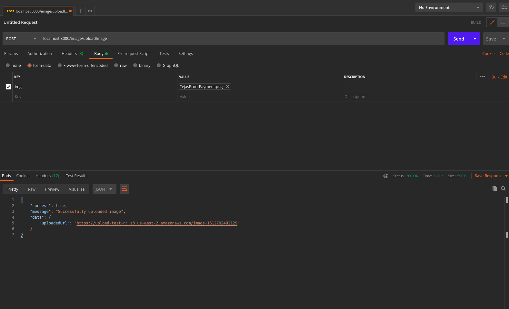

## Introduction

- This is a simple implementation of a image processing server using NodeJS + ExpressJS.
- It uses an S3 backend to store the processed images.

## How to setup

- The first step is to fill out the configuration in the env_setup.sh file. This file contains 4 major fields:
    - AWS_REGION: This is the AWS Region to use in general. (example: 'us-east-2')
    - AWS_ACCESS_KEY: This is the Access Key of an IAM user account with enough permissions to read and write on the S3 bucket to be used for storage.
    - AWS_SECRET_KEY: This is the secret Key of the same IAM user account.
    - AWS_S3_BUCKET: This is the S3 bucket used as the storage backend.

- Next after filling out the fields above, we will source the file to export the environment variables: `source ./env_setup.sh`

- Next step is to install all the dependencies: `npm install`

- Finally start the server: `npm start`. The server will start on `localhost:3000`

## How to test
- The API can be tested using any HTTP request making tool, recommended is `Postman` because of its simplicity and the options it provides to automatically fill out the headers.

- The path for the API is: `/image/uploadImage`
- The endpoint is a `POST` endpoint. In postman, select the appropriate method(POST) and enter the url: `http://localhost:3000/image/uploadImage`. Then select `form-data` option, since we will be simulating a form data being posted.
- In the key-value pairs, for the key select the type to be a `FILE`. The value field will give a file picker option. Choose any image file. The key should contain the string `img` (The server accepts only this). Then send the request. 
- The response should contain a field called `uploadedUrl` which points to a url from which the image can be accessed.
- Here is an example: 

## Code organization

- The backend API server is organized into following components:
    - `service`: This directory contains various services ran by the backend server. In our case there is a single service called `image`. Each service has 3 major files:
        - `routes.js` used for defining the API routes, `controllers.js` which is used for defining the middleware handler to process the request and `db.js` which generally accessed the data layer or any backend and consists most of the processing logic.
    - `lib`: Contains the library code which is used commanly across all services.
    - `config`: Contains all kind of config used across all services

## Maintainers

- Nisarg S. Joshi
